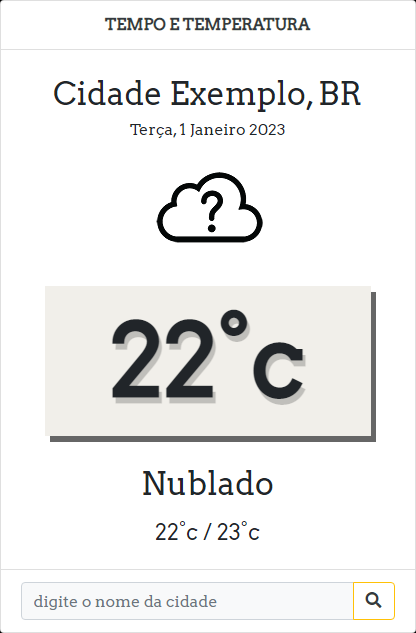

# <h1 align=center>🌠weather-app 🌠</h1>

  

Wheather app is a temperature and city query project, also accompanies geolocation for the user

## Languages 
- HTML
- CSS
- JAVASCRIPT
- API
- Figma

📌Project may be found here 

- [wheater-app ](https://istivis.github.io/weather-app/)
